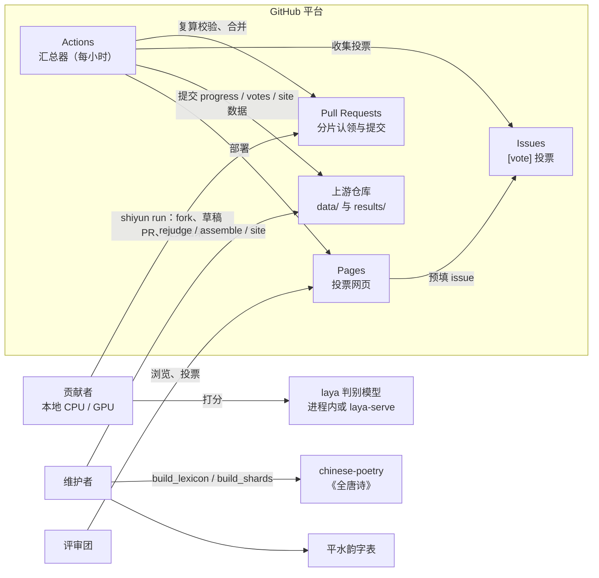
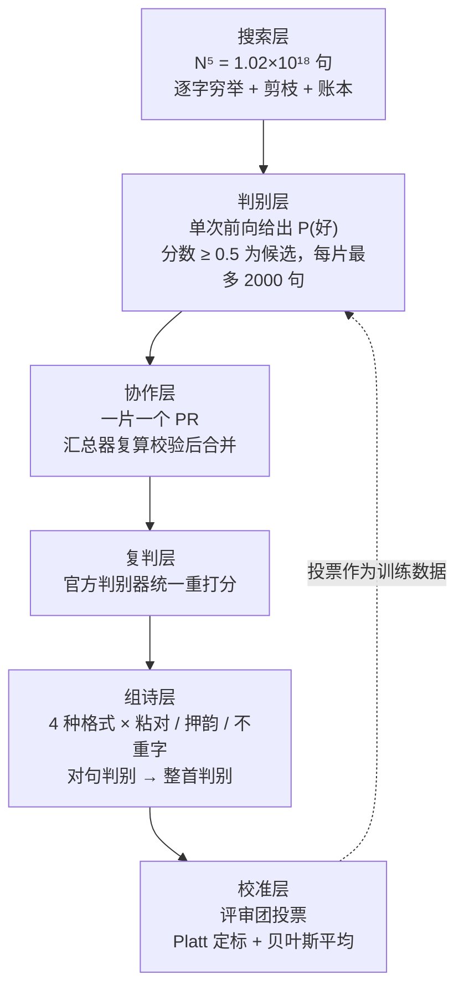
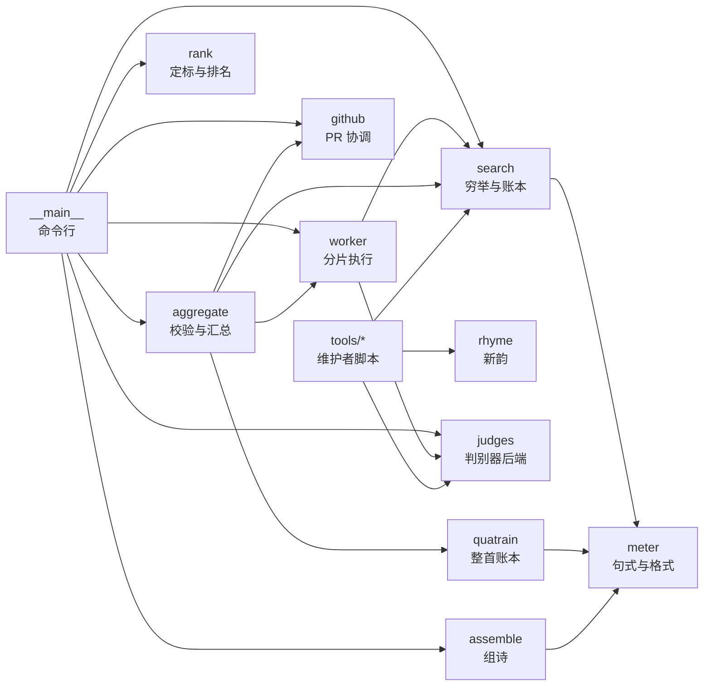
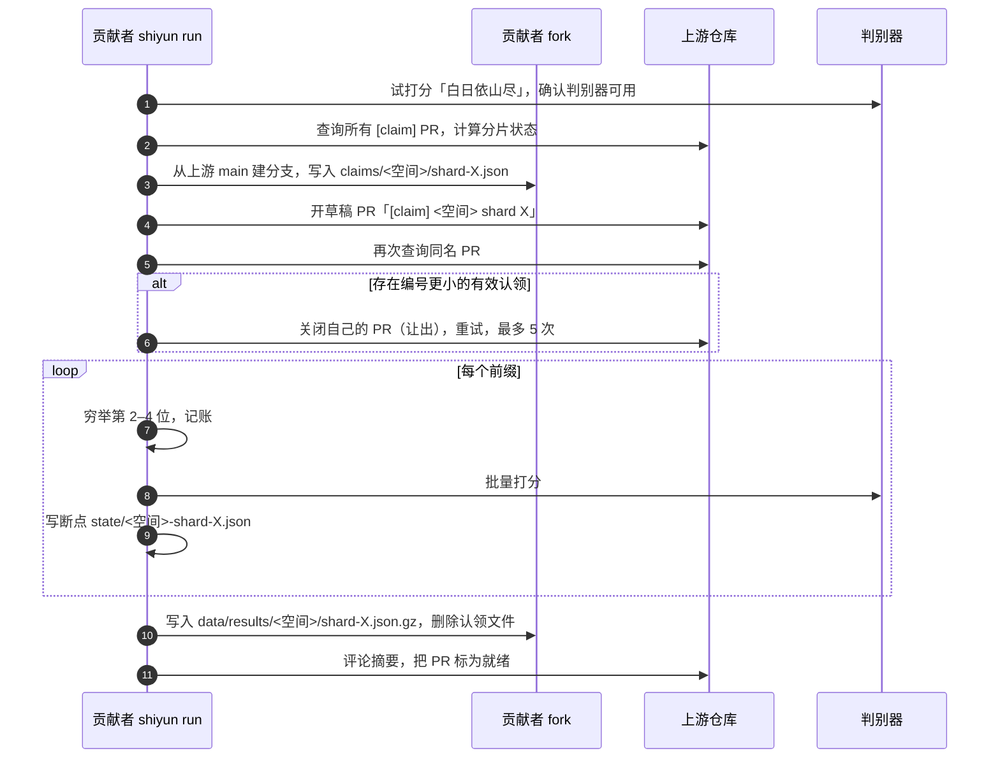
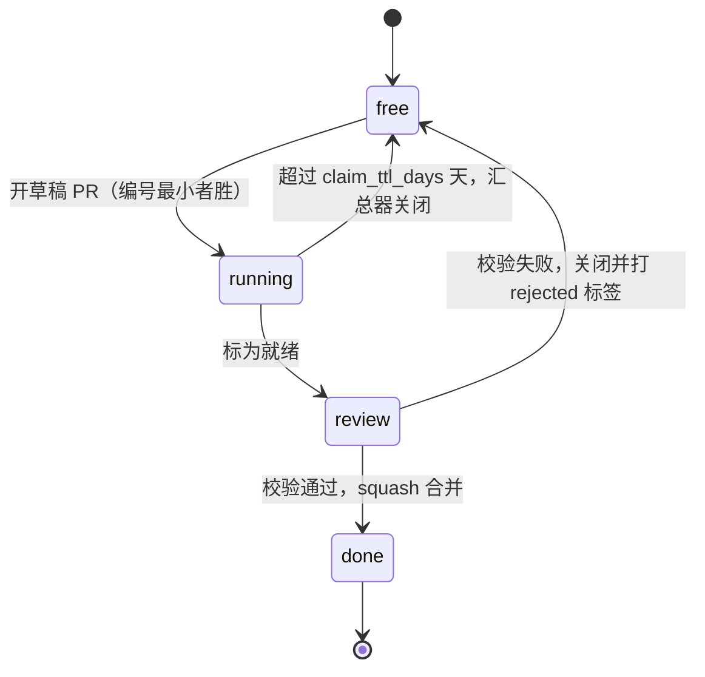
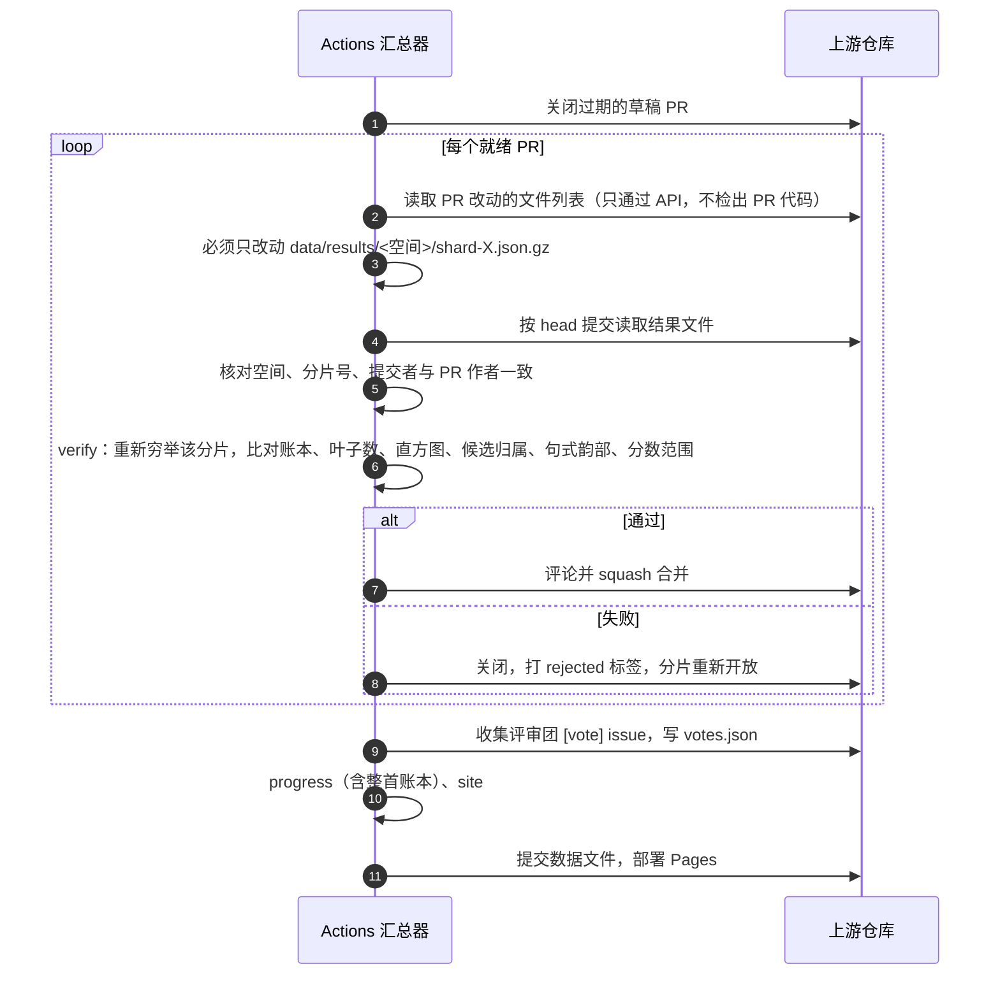
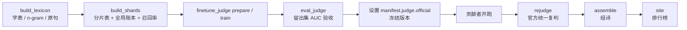

# 诗云 · PoetryCloud 架构设计说明书

| 项 | 内容 |
|---|---|
| 文档编号 | SY-ARCH-001 |
| 版本 | 0.2（草案） |
| 状态 | 评审中 |
| 适用代码 | `shiyun` 0.1.0，基线提交 `f86cdec` 加当前工作区改动（PR 协作、双格律空间、统一复判、评审团） |
| 关联文档 | [`README.md`](../README.md)、[`docs/v1-decisions.html`](v1-decisions.html)（v1 决策单 D1–D10） |
| 更新日期 | 2026-10-02 |

**变更记录**

| 版本 | 日期 | 说明 |
|---|---|---|
| 0.1 | 2026-10-02 | 基于 `f86cdec`：Issue 协作、单一新韵空间 |
| 0.2 | 2026-10-02 | 按当前工作区重写：PR 协作、平水韵与新韵两个空间、官方复判、评审团投票、20 字整首账本；补充 SDLC 规范 |

---

## 目录

1. [概述](#1-概述)
2. [需求](#2-需求)
3. [约束与假设](#3-约束与假设)
4. [架构总览](#4-架构总览)
5. [模块设计](#5-模块设计)
6. [数据架构](#6-数据架构)
7. [关键流程](#7-关键流程)
8. [正确性设计：穷举账本](#8-正确性设计穷举账本)
9. [安全与可信](#9-安全与可信)
10. [部署与运维](#10-部署与运维)
11. [质量保证与测试策略](#11-质量保证与测试策略)
12. [研发流程规范（SDLC）](#12-研发流程规范sdlc)
13. [架构决策记录](#13-架构决策记录)
14. [风险与技术债](#14-风险与技术债)
15. [路线图](#15-路线图)
16. [附录](#16-附录)

---

## 1. 概述

### 1.1 背景

刘慈欣《诗云》里，神级文明穷举了所有汉字组合，却挑不出好诗。诗云项目反过来做：逐字穷举五言绝句，同时用判别模型和人的投票把好诗挑出来。

### 1.2 目标

| 编号 | 目标 |
|---|---|
| G1 | 在“句”这一层做到**可证明的完整穷举**：N⁵ 种五字组合（N = 4000）每一种都被考虑过，要么进入判别，要么被某条规则成片判死，并且有账可查。 |
| G2 | 把计算拆成分片，让任何有 GitHub 账号的人都能贡献算力，**不需要中心服务器**。 |
| G3 | 所有入库结果**可复算校验**；入库分数全部出自同一个官方判别器。 |
| G4 | 在好句池上穷举组成五言绝句，由评审团投票校准，产出排行榜。 |

### 1.3 范围

- **范围内**：五言单句穷举（第一阶段）、五言绝句组诗（第二阶段）、判别器接入与微调、分布式协作、汇总校验、投票网页。
- **范围外（v1）**：七言、律诗；第二阶段的分布式化；有后端的投票系统；生成式写诗。

### 1.4 术语

| 术语 | 含义 |
|---|---|
| 空间（meter） | 一套格律体系对应的独立搜索空间。`psy` 是平水韵（默认），`xin` 是中华新韵。两者的平仄和韵部取 `chars.tsv` 中不同的列，结果互不混用。 |
| 叶子（leaf） | 通过全部剪枝、进入判别器的五字句。 |
| 前缀（prefix） | 通过剪枝的二字开头。全局前缀表是分片的基本单位。 |
| 分片（shard） | 前缀表上的一段连续区间，按叶子数大致均衡切分。 |
| 账本（ledger） | 叶子数加上每条规则、每一位的剪枝数。用于证明穷举完整。 |
| 判别器（judge） | 只输出“是好诗的概率”∈ [0, 1] 的模型，不生成文字。 |
| 官方判别器 | `manifest.judge.official` 指定的判别器 id，汇总端用它统一复判。 |
| 空间哈希 | `space_sha256`：字表、n-gram、搜索参数、格律名一起算出的 SHA-256。任何一项变化，旧结果都作废。 |
| 重新发现 | 穷举出的句子恰好是唐诗原句。照常判别，但不进排名（决策 D6-A）。 |
| 评审团 | `data/reviewers.json` 里的 GitHub 用户，只有他们的票计入排名。 |

---

## 2. 需求

### 2.1 功能需求

| 编号 | 需求 | 实现位置 |
|---|---|---|
| FR-01 | 按 manifest 参数对指定空间做逐字穷举与剪枝（规则：`lm` 语言模型下界、`dup` 重字、`tone` 平仄） | `shiyun/search.py` |
| FR-02 | 追踪任意一句在搜索树上的命运（在第几字、被哪条规则剪掉） | `Space.trace`，命令 `trace` |
| FR-03 | 接入多种判别器后端：laya（进程内或 HTTP）、Jev、OpenAI 兼容、ngram | `shiyun/judges/` |
| FR-04 | 跑一个分片：穷举、判别、筛候选，按前缀存断点，可续跑 | `shiyun/worker.py` |
| FR-05 | 通过 PR 认领分片、提交结果，撞车时 PR 编号小者胜，认领过期自动释放 | `shiyun/github.py`，命令 `run` / `status` |
| FR-06 | 汇总器复算账本、校验候选，通过则 squash 合并，不通过则关闭并打 `rejected` 标签 | `shiyun/aggregate.py`，命令 `aggregate` |
| FR-07 | 维护者用官方判别器统一复判所有候选 | `aggregate.rejudge`，命令 `rejudge` |
| FR-08 | 计算进度，包括 N²⁰ 整首空间的精确账本 | `shiyun/quatrain.py`、`write_progress`，命令 `progress` |
| FR-09 | 第二阶段：在好句池上按四种绝句格式穷举组诗，判对句和整首 | `shiyun/assemble.py`，命令 `assemble` |
| FR-10 | 收集评审团的 `[vote]` issue，Platt 定标后做贝叶斯平均，生成排行榜 | `aggregate.collect_votes`、`shiyun/rank.py`，命令 `site` |
| FR-11 | 静态投票网页，投票结果以预填 issue 的方式提交 | `site/index.html` |
| FR-12 | 维护者工具：重建字表与统计、生成分片表、判别器微调与评测 | `tools/` |

### 2.2 非功能需求

| 编号 | 类别 | 要求 | 验收方式 |
|---|---|---|---|
| NFR-01 | 正确性 | 单句账本按精确整数满足 `Σ叶子 + Σ剪枝×N^(4−d) = N⁵`；整首账本满足 `Σ剪枝 + 通过 + 待定 = N²⁰` | `build_shards.py` 断言；`test_exhaustive_ledger`、`test_quatrain_ledger_matches_brute_force` |
| NFR-02 | 确定性 | 相同的空间哈希下，任何机器复算同一分片，账本和叶子集合逐项一致 | 汇总器 `verify` 逐项比对 |
| NFR-03 | 可信 | 伪造账本、伪造候选、改句式韵部、改空间，都必须被拒绝；入库分数全部来自官方判别器 | `test_tampering_rejected` 五种攻击；`rejudge` |
| NFR-04 | 零运维 | 不依赖自建服务；协调只用 GitHub PR、Issue、Actions、Pages | 架构约束 |
| NFR-05 | 低门槛 | 核心只依赖 Python ≥ 3.10 标准库；参与者只需要 `gh` CLI 登录 | `pyproject.toml` 中 `dependencies = []` |
| NFR-06 | 可恢复 | 分片计算中断后从上一个完成的前缀续跑；判别器 id 或空间哈希变化时不误用旧断点 | `run_shard` 断点逻辑 |
| NFR-07 | 性能 | 汇总端复算一个分片不调判别器，秒级完成；分片目标 200 万叶子（`shard_target`） | 汇总日志 |
| NFR-08 | 可追溯 | 每个结果记录空间哈希、判别器 id、提示词版本、贡献者；每张票可追溯到 GitHub 用户 | 结果文件字段 |

---

## 3. 约束与假设

**约束**

- C1：五言绝句全空间约 4000²⁰ ≈ 10⁷² 首，无法逐首枚举，只能逐句穷举加剪枝，再在句的层面组诗。
- C2：剪枝必须是确定性的，不能依赖浮点不稳定的神经网络。目前只用 n-gram、重字、平仄三种规则。
- C3：协调层只能用 GitHub 提供的原语，认领不是原子操作，需要“编号最小者胜”来裁决冲突。
- C4：汇总在 GitHub Actions 上运行，单次任务有时长和算力上限，复算分片不能调用判别器。
- C5：改动字表、n-gram 或 `search` 参数会改变空间哈希，旧结果全部作废。因此参数必须先冻结再开跑。

**假设**

- A1：唐诗五言原句可以作为“好句”的近似标尺，用来衡量剪枝召回率和判别器召回率。
- A2：参与者可能作恶，但无法伪造 GitHub 身份。
- A3：微调后的 laya 能把“唐诗原句 vs 打乱字序”的 AUC 提到明显高于 0.5（尚未验证，见风险 R1）。

---

## 4. 架构总览

### 4.1 系统上下文



### 4.2 五层流水线



### 4.3 部署视图

| 运行位置 | 运行内容 | 触发方式 |
|---|---|---|
| 贡献者本机 | `python -m shiyun run`：认领、计算、提交 | 手动，循环运行 |
| 可选的 GPU 机器 | `laya-serve`，提供 `/v1/systemone/batch` | 贡献者自建 |
| GitHub Actions（`aggregate.yml`） | `aggregate`、`progress`、`site`，提交数据，部署 Pages | 每小时第 17 分钟；PR 标为就绪时；手动 |
| 维护者本机 | `build_lexicon`、`build_shards`、`rejudge`、`assemble`、微调与评测 | 手动 |
| GitHub Pages | `site/index.html` 加 `site/data.json` | 由 Actions 部署 |

### 4.4 架构原则

1. **账本优先**：每一处剪枝都要记账，账本恒等式是穷举完整性的唯一证据。
2. **可复算优于可信任**：凡是能复算的都复算（账本、叶子归属、句式、韵部）；不能零成本复算的分数，由官方统一复判。
3. **数据即接口**：模块之间通过 `data/` 下带版本的文件交互，不共享进程状态。
4. **配置冻结**：搜索参数集中在 `manifest.json` 并参与哈希；冻结之后再改就是新版本。
5. **核心零依赖**：判别模型、拼音、繁简转换都是可选依赖。

---

## 5. 模块设计

### 5.1 模块依赖



### 5.2 模块职责

| 模块 | 职责 | 主要接口 | 外部依赖 |
|---|---|---|---|
| `search.py` | 加载字表和 n-gram，构造剪枝结构，分支定界穷举，维护账本，计算空间哈希，切分片 | `Space(meter)`、`prefixes()`、`run_prefixes(start, end, on_leaf, ledger)`、`trace(text)`、`Ledger`、`build_shards()`、`load_shards()` | 无 |
| `meter.py` | 四种句式 A/B/C/D 的判定（二四异、无三平尾、无孤平），四种绝句格式及押韵位置 | `line_type()`、`FORMS`、`rhymes(form)` | 无 |
| `rhyme.py` | 拼音韵母到中华新韵十四韵的映射，只在构建字表时用 | `rhyme_of_pinyin()` | 无 |
| `judges/` | 统一的判别器协议 `score(texts, kind)`，`kind` 可以是 line、couplet、poem；提示词和版本号 | `make_judge()`、`LayaJudge`、`JevJudge`、`OpenAIJudge`、`NgramJudge`、`PROMPT_VERSION` | laya（可选） |
| `worker.py` | 跑一个分片，按前缀存断点，汇总直方图、唐诗原句命中、候选，序列化结果 | `run_shard()`、`dump_result()`、`load_result()`、`RESULT_VERSION` | 无 |
| `github.py` | 通过 `gh` CLI 和 GitHub API 管理认领 PR、分片状态、合并或关闭、投票 issue；不改动本地 git 工作区 | `Contributor.claim/submit`、`shard_status()`、`ready_claims()`、`stale_claims()`、`merge()`、`close()` | `gh` CLI |
| `aggregate.py` | 结果校验 `verify`，合并 PR，官方复判，好句池，进度，评审票收集 | `verify()`、`aggregate_github()`、`aggregate_local()`、`rejudge()`、`load_pool()`、`write_progress()`、`collect_votes()` | 无 |
| `quatrain.py` | 按“句式 × 韵部”签名分组做动态规划，精确计算 N²⁰ 整首空间的剪枝、通过、待定首数 | `ledger(n, passed, pending)` | 无 |
| `assemble.py` | 第二阶段组诗：按句式取每类前 K 句，配对句（剪重字、押韵、对句分），保留每联前 600 对，拼全诗，整首判别 | `assemble()`、`poem_id()` | 无 |
| `rank.py` | Platt 定标，贝叶斯平均（先验权重 3 票），生成 `site/data.json` 与 `calibration.json` | `calibrate()`、`rank()`、`build_site()` | 无 |
| `__main__.py` | 命令行入口，共 11 个子命令 | 见附录 A | 无 |
| `tools/build_lexicon.py` | 下载《全唐诗》和平水韵，生成 `chars.tsv`、`ngram.tsv.gz`、`known_lines.txt.gz` | 脚本 | pypinyin、opencc |
| `tools/build_shards.py` | 生成 `shards-<空间>.tsv`，断言全局账本，测剪枝召回率，回写 `manifest.spaces` | 脚本 | 无 |
| `tools/finetune_judge.py` | 生成微调数据（正样本是唐诗原句，负样本是打乱、替换、搜索叶子），调用 laya 官方单机脚本训练 | `prepare`、`train` | laya |
| `tools/eval_judge.py` | 在留出集上测判别器 AUC | 脚本 | 判别器 |

### 5.3 搜索层要点

- **分位置“顿”模型**：五言是“二|三”节奏。第 0、2 位（句首、顿后）只看该位置的字频；其余位置用插值二元模型 `log(λ·P(b|a) + (1−λ)·P_d(b))`，λ = 0.9。没见过的搭配不会被直接判死，只是更难过界。
- **分支定界**：孩子按对数概率降序产出，一旦跌破 `lm_floor[d] − 当前分`，其余孩子整批记为 `lm` 剪枝。不需要逐个尝试 N 个字，账本仍然精确。
- **平仄位掩码**：`tone_mask[d][i]` 是第 d 位放第 i 个字后仍然可行的合律平仄模式集合。与运算结果为 0 就剪枝（`tone`）。
- **两级切分**：第 0、1 位在全局只展开一次，得到前缀表，账本不属于任何分片；第 2–4 位在分片内做深度优先展开。

### 5.4 判别层要点

- 判别器 id 的格式为 `后端:模型:p提示词版本`。本地检查点用“目录名@权重哈希前 8 位”，保证不同权重的 id 不同。
- 训练与推理共用 `judges._state` 和 `_noul_question`，保证输入格式完全一致。
- 不同判别器的分数不可比较，结果里都记录 `judge` 字段；入库排名统一用 `official` 分数。

---

## 6. 数据架构

### 6.1 数据资产

| 文件 | 生成者 | 是否入库 | 是否影响空间哈希 | 说明 |
|---|---|---|---|---|
| `data/chars.tsv` | `build_lexicon` | 是 | **是** | 每行：字、新韵平仄、新韵韵部、平水韵平仄、平水韵平声韵部、频次。行序就是枚举顺序。 |
| `data/ngram.tsv.gz` | `build_lexicon` | 是 | **是** | 一元、二元（计数 ≥ 2）、分位置字频（`@d字`） |
| `data/known_lines.txt.gz` | `build_lexicon` | 是 | 否 | 唐诗五言原句，用于标记“重新发现”、测召回率、微调和评测 |
| `data/manifest.json` 的 `search` 段 | 维护者 | 是 | **是** | `caesura`、`lambda`、`lm_floor[5]` |
| `data/manifest.json` 其他字段 | 维护者、`build_shards` | 是 | 否 | 仓库、认领有效期、判别阈值、官方判别器、各空间统计 |
| `data/shards-<空间>.tsv` | `build_shards` | 是 | 否（由哈希决定） | 每行：分片号、起始前缀、结束前缀、叶子数 |
| `data/results/<空间>/shard-XXXXXX.json.gz` | 贡献者经 PR 合入 | 是 | — | 分片结果，见 6.2 |
| `data/progress.json` | Actions | 是 | — | 各空间进度与整首账本 |
| `data/votes.json` | Actions | 是 | — | `{诗 id: {用户: 1 / 0 / −1}}` |
| `data/reviewers.json` | 维护者 | 是 | — | 评审团名单 |
| `data/calibration.json` | `site` | 是 | — | 每个空间的 Platt 参数 a、b |
| `data/poems-<空间>.json` | `assemble` | 是 | — | 组诗结果与组诗账本 |
| `site/data.json` | `site` | 是 | — | 网页数据 |
| `state/`、`out/`、`.cache/`、`models/` | 本地 | 否 | — | 断点、本地输出、下载缓存、微调权重 |

### 6.2 分片结果格式（`RESULT_VERSION = 2`）

文件用 gzip 压缩（`mtime=0`，保证同样内容得到同样字节），内容为 JSON：

```json
{
  "v": 2,
  "meter": "psy",
  "shard": 123,
  "space_sha256": "…",
  "judge": "laya:multilingual:p1",
  "prompt_version": 1,
  "ledger": {"leaves": 0, "pruned": {"lm": [0,0,0,0,0], "dup": [0,0,0,0,0], "tone": [0,0,0,0,0]}},
  "judged": 0,
  "hist": [0,0,0,0,0,0,0,0,0,0],
  "known": {"n": 0, "hit": 0},
  "elapsed": 0.0,
  "candidates": [["句子", 0.91, -4.12, "AC", "寒|删", 0]],
  "contributor": "github-login",
  "official": {"judge": "…", "scores": [0.87]}
}
```

`candidates` 每项依次是：文本、提交者分数、平均每字对数概率、可能句式、末字平声韵部（仄收为 `-`）、是否唐诗原句。`official` 由 `rejudge` 写入，提交时不存在。

### 6.3 版本控制规则

| 版本号 | 何时递增 | 影响 |
|---|---|---|
| 空间哈希 `space_sha256` | 字表、n-gram、`search` 参数或格律名任何变化 | 旧分片表与旧结果全部作废；必须重跑 `build_shards` |
| `manifest.version` | 冻结一个新的搜索版本（v1 → v2） | 对外的版本标识 |
| `RESULT_VERSION` | 结果文件结构变化 | 汇总器拒收旧格式 |
| `PROMPT_VERSION` | 判别提示词变化 | 判别器 id 变化，断点失效，需要重新复判 |
| `pyproject.version` | 代码发布 | 遵循语义化版本 |

---

## 7. 关键流程

### 7.1 认领、计算与提交



分片状态由 PR 状态推导：



### 7.2 汇总校验



### 7.3 维护者流程



### 7.4 投票与校准

1. 评审团在网页上给绝句投“好诗 / 一般 / 不行”，记录在浏览器 `localStorage`。
2. 点“提交到 GitHub”，打开一个预填 JSON 的 `[vote]` issue。
3. 汇总器只计入 `reviewers.json` 里成员的票，每人每首以最后一票为准；非成员的 issue 会被礼貌关闭。
4. `rank.calibrate` 以“好 = 1、一般 = 0.5、不行 = 0”为软标签拟合 `σ(a·s + b)`（少于 5 首有票时退化为 a = 1、b = 0）。
5. 综合分 `final = (票值之和 + 3·定标概率) / (票数 + 3)`。

---

## 8. 正确性设计：穷举账本

### 8.1 单句账本

剪掉第 d 位（从 0 开始）的一个结点，等于一次判掉其下 N^(4−d) 句。任何时刻都满足精确整数等式：

```
Σ 叶子数 + Σ_rule Σ_d pruned[rule][d] × N^(4−d) = N⁵
```

- 全局账本 = 前缀账本（第 0、1 位，全局只算一次）+ 各分片账本之和。由 `build_shards.py` 断言。
- 单个分片的账本由汇总器复算比对，保证提交者既没有多剪，也没有漏剪。
- `test_exhaustive_ledger` 用小字表暴力枚举全部组合，逐句对照剪枝结果。

### 8.2 整首账本

单句只有三种状态：通过（带“句式 × 韵部”签名）、未通过、待定（分片未完成）。按签名分组做动态规划，可以精确算出 N²⁰ 首里每一类的数量：

```
Σ 剪掉的首数（单句未通过 + 粘对押韵不合）+ 通过初筛的首数 + 待定首数 = N²⁰
```

待定首数降到 0，就是 20 字空间初筛完成。`test_quatrain_ledger_matches_brute_force` 在 2²⁰ 的小空间里逐首核对。

### 8.3 组诗账本

`assemble` 按“枚举对句、剪重字、剪押韵、剪对句分、剪对句排名、枚举全诗”计数，写入 `poems-<空间>.json` 的 `ledger`。注意：组诗层用了“每类前 K 句”和“每联前 600 对”的截断，**不是**完整穷举，账本只记录截断量。

---

## 9. 安全与可信

### 9.1 威胁与对策

| 威胁 | 攻击方式 | 对策 | 残余风险 |
|---|---|---|---|
| 伪造候选 | 提交不属于该分片的句子 | 复算该分片叶子集合，逐个核对候选 | 无 |
| 伪造账本 | 少算或多算剪枝 | 复算账本逐项比对 | 无 |
| 篡改元数据 | 改句式、韵部、空间、数量 | 与复算结果比对；校验空间哈希与版本 | 无 |
| 虚报高分 | 提交者报高分让句子入池 | 官方判别器统一复判，排名只用 `official` 分数 | 复判前的进度统计用提交者分数 |
| 漏报好句 | 用差的判别器或故意压低分数 | 判别直方图、唐诗原句命中率可以辅助发现异常 | **无法完全发现**；需要冗余计算才能防住 |
| 冒用身份 | 替别人提交 | 结果中的 `contributor` 必须等于 PR 作者 | 依赖 GitHub 账号安全 |
| 恶意 PR 代码 | PR 里夹带脚本，在 Actions 中执行 | 使用 `pull_request_target`，只检出 `main`，只通过 API 读取 PR 中的数据文件；PR 只允许改动一个结果文件 | 需要维持“不检出 PR 代码”这条纪律 |
| 解压炸弹或畸形数据 | 超大或损坏的 gzip / JSON | 任何解析异常都视为校验失败 | 尚无大小上限（见 R6） |
| 刷票 | 批量开 `[vote]` issue | 只计评审团成员；每人每首以最后一票为准 | 评审团名单靠人工维护 |
| 认领占坑 | 大量开草稿 PR 不提交 | `claim_ttl_days = 7` 后自动关闭 | 7 天内仍可占坑 |

### 9.2 权限

`aggregate.yml` 需要 `contents`、`pull-requests`、`issues`、`pages` 的写权限，以及 `id-token`。使用 `concurrency: aggregate` 保证同一时间只有一个汇总任务。

---

## 10. 部署与运维

### 10.1 首次部署

1. 在 `data/manifest.json` 中填写 `github_repo`。
2. 维护者运行 `build_lexicon`（可选，数据已入库），然后对每个空间运行 `python tools/build_shards.py --meter psy|xin`。
3. 微调并评测判别器，把验收通过的判别器 id 写入 `manifest.judge.official`。
4. 仓库设置中把 Pages 来源设为 GitHub Actions。
5. 填写 `data/reviewers.json`。
6. 冻结版本（见 12.5），通知贡献者开跑。

### 10.2 配置项

| 配置 | 位置 | 当前值 | 改动影响 |
|---|---|---|---|
| `search.caesura`、`lambda`、`lm_floor` | manifest | `true`、0.9、[−9.0, −13.6, −18.2, −22.8, −27.4] | **改变空间哈希** |
| `shard_target` | manifest | 2,000,000 | 需要重新切分片 |
| `claim_ttl_days` | manifest | 7 | 即时生效 |
| `judge.submit_threshold` | manifest | 0.5 | 影响候选与校验 |
| `judge.max_candidates_per_shard` | manifest | 2000 | 影响校验 |
| `judge.official` | manifest | 空 | 空表示尚未指定；`rejudge` 和 `run` 据此告警 |
| `SHIYUN_METER`、`SHIYUN_JUDGE`、`SHIYUN_BASE_URL`、`SHIYUN_MODEL`、`SHIYUN_DEVICE`、`SHIYUN_API_KEY` | 环境变量 | — | 命令行默认值 |

### 10.3 监控与运维

| 关注点 | 数据来源 | 处理方式 |
|---|---|---|
| 分片进度 | `shiyun status`、`progress.json`、网页 | — |
| 拒收率 | 带 `rejected` 标签的 PR | 拒收集中出现时，检查是否有贡献者用了旧版本代码或数据 |
| 判别器漂移 | 结果中的 `hist`、`known.hit / known.n` | 与官方判别器基线比对，异常时重点复判 |
| 汇总失败 | Actions 运行记录 | 汇总是幂等的，修复后手动触发即可 |
| 仓库体积 | `data/results/` | 约 742 个以上的 gzip 文件，需要关注（见 R7） |

---

## 11. 质量保证与测试策略

### 11.1 现有测试

| 测试 | 覆盖 | 前置条件 |
|---|---|---|
| `test_search.py::test_exhaustive_ledger` | 小字表暴力枚举，逐句对照剪枝结果与账本恒等式 | 无 |
| `test_search.py::test_shards_partition` | 分片恰好覆盖前缀表、互不重叠 | 无 |
| `test_search.py::test_ledger_roundtrip` | 账本序列化往返 | 无 |
| `test_search.py::test_meter` | 句式判定、重字规则 | 无 |
| `test_quatrain.py`（2 个） | 整首账本与 2²⁰ 小空间暴力枚举逐项相等；无待定时初筛完成 | 无 |
| `test_pipeline.py`（6 个） | 用 ngram 判别器跑真实最小分片，校验通过；五种篡改全部被拒 | **需要 `shards-psy.tsv`** |

2026-10-02 在当前工作区运行 `PYTHONPATH=. pytest -q`，结果是 6 个通过、6 个跳过。跳过原因是分片表尚未生成（`manifest.spaces` 为空）。

### 11.2 测试分层要求

| 层级 | 要求 |
|---|---|
| 单元测试 | 新增剪枝规则、格律规则、账本逻辑，必须附带小空间暴力枚举对照测试 |
| 集成测试 | 端到端用 `ngram` 判别器跑真实分片，再经 `verify` 校验；新增结果字段时同时补一条篡改用例 |
| 模型验收 | 判别器上线前在留出集上跑 `eval_judge`，三组负样本的 AUC 都要达到门槛（门槛待定，建议 ≥ 0.80），并记录模型 id 与结果 |
| 回归 | 空间哈希不变的改动，必须保证 `build_shards` 的全局账本与召回率不变 |
| 安全回归 | 改动 `aggregate.yml` 或 `github.py` 时，要人工确认没有检出或执行 PR 代码 |

### 11.3 完成定义（DoD）

- 测试全部通过，并且不是因为跳过而通过（需要先有分片表）。
- 账本恒等式和篡改用例保持通过。
- 改动空间哈希的变更已经过 12.4 的变更评审。
- README、本文档、manifest 同步更新。

---

## 12. 研发流程规范（SDLC）

### 12.1 阶段与产出


| 阶段 | 输入 | 活动 | 产出 | 准入 / 准出标准 |
|---|---|---|---|---|
| 1 需求与提案 | 路线图、问题反馈、运行数据 | 开 issue 说明动机、范围、是否改变空间哈希 | 带标签的 issue（`feature` / `bug` / `space-change` / `judge`） | 准出：维护者确认纳入版本 |
| 2 设计与决策 | 已确认的 issue | 写设计说明或 ADR；涉及取舍时，给出选项与建议，由维护者拍板 | 本文档更新、`docs/adr/NNNN-*.md` 或决策单 | 准出：决策已记录，改变搜索空间的项已列出 |
| 3 实现 | 设计 | 在功能分支上开发，小步提交 | PR | 准出：自测通过；代码风格与现有代码一致（核心只用标准库） |
| 4 测试与验收 | PR | 单元、集成、篡改、模型验收；代码评审 | 评审意见、测试记录、`eval_judge` 结果 | 准出：满足 11.3 完成定义，至少一名维护者批准 |
| 5 发布与冻结 | 合并后的 main | 重建字表与分片表，更新 manifest，打标签 | `vX.Y` 标签、发布说明、冻结后的 manifest | 准出：见 12.5 检查表 |
| 6 运行与运维 | 已冻结版本 | 贡献者计算，Actions 汇总，维护者复判与组诗 | `results/`、`progress.json`、网页 | 持续：监控 10.3 中的指标 |
| 7 复盘与演进 | 运行数据、投票 | 评估召回率、AUC、拒收率、投票一致性 | 复盘记录、新提案 | — |

### 12.2 分支与提交规范

- `main` 是唯一的长期分支，受保护。汇总器的数据提交（`shiyun-bot`）和结果 PR 的 squash 合并直接进入 `main`。
- 开发分支命名：`feat/<主题>`、`fix/<主题>`、`docs/<主题>`、`space/<主题>`（会改变空间哈希的改动）。
- 分片分支 `shard/<空间>-XXXXXX-<时间戳>` 由工具自动创建，开发者不要手动使用。
- 提交信息用中文，格式为 `<类型>：<摘要>`，类型取 `功能`、`修复`、`文档`、`测试`、`重构`、`数据`、`空间`。改变空间哈希的提交必须用 `空间` 类型。

### 12.3 代码评审清单

- [ ] 是否改变空间哈希（字表、n-gram、`search` 参数、格律列）？如果是，是否走了 12.4 的流程？
- [ ] 新增或修改的剪枝是否全部记账？小空间暴力测试是否覆盖？
- [ ] 结果文件结构是否变化？如果是，是否递增了 `RESULT_VERSION` 并补充 `verify` 与篡改用例？
- [ ] 提示词是否变化？如果是，是否递增了 `PROMPT_VERSION`？
- [ ] 核心包是否引入了第三方依赖？（不允许，只能放在可选依赖中）
- [ ] 工作流是否仍然不检出、不执行 PR 的代码？
- [ ] README 和本文档是否同步？

### 12.4 变更分级

| 级别 | 示例 | 流程 |
|---|---|---|
| L0 文档 | 文档、注释 | 一名评审即可合并 |
| L1 兼容改动 | 新增命令、性能优化、判别器后端、网页 | 评审加测试 |
| L2 协议改动 | 结果格式、认领协议、校验规则、工作流权限 | 评审加测试加 ADR；考虑运行中分片的兼容 |
| L3 空间改动 | 字表、n-gram、剪枝参数、格律规则、新增空间 | 必须写 ADR，并在决策单中拍板；只能在两个版本之间进行；合并后旧结果作废，`manifest.version` 递增 |

### 12.5 版本冻结检查表

- [ ] L3 决策全部定稿（参考 `v1-decisions.html` 中的 D3、D4、D5）。
- [ ] 对每个空间运行 `build_shards.py`，全局账本断言通过，召回率已记录到 `manifest.spaces`。
- [ ] 分片表、字表、n-gram、manifest 已提交。
- [ ] 官方判别器通过模型验收，id 已写入 `manifest.judge.official`。
- [ ] 测试全部通过，`test_pipeline` 不再跳过。
- [ ] README 中的命令、数字与代码一致。
- [ ] 打 `vX.Y` 标签，在发布说明中写明空间哈希、分片数、叶子数、召回率、官方判别器。

### 12.6 缺陷处理

| 严重度 | 定义 | 处理时限 |
|---|---|---|
| S1 | 账本不平、校验可被绕过、工作流执行了不可信代码 | 立即停止汇总（禁用工作流），修复后再恢复 |
| S2 | 汇总失败、结果无法提交、复判出错 | 下一个汇总周期之前 |
| S3 | 网页显示、日志、文档问题 | 随下一次发布 |

---

## 13. 架构决策记录

v1 的待决策项见 [`v1-decisions.html`](v1-decisions.html)。下表根据当前代码推断各项的落地情况。**这是从代码推断的，不是正式拍板记录，请维护者确认后改为“已决定”。**

| 编号 | 主题 | 代码中的现状 | 依据 |
|---|---|---|---|
| D1 | 判别器模型 | 先做微调 laya（A），保留 openai 后端以便将来级联 | `tools/finetune_judge.py` 文档写明 D1-A |
| D2 | 训练数据 | 以“像唐诗”为目标（A） | `finetune_judge.py` 写明 D2-A |
| D3 | 剪枝松紧 | 下界改成了按位置的线性数组 `lm_floor`，具体档位待确认 | `manifest.search.lm_floor` |
| D4 | 格律标准 | 平水韵与新韵两个空间都支持（C），默认平水韵 | `search.METERS`、命令行默认 `psy` |
| D5 | 字表与语料 | 唐诗前 4000 字（A） | `build_lexicon --n-chars 4000` |
| D6 | 撞上唐诗原句 | 照常判别，标为重新发现，不进排名（A） | `load_pool` 默认排除 `known` |
| D7 | 协作通道 | 改为 Pull Request（B），fork 和建分支由工具通过 API 自动完成 | `github.py` |
| D8 | 信任 | 汇总端统一复判（B） | `aggregate.rejudge` |
| D9 | 组诗由谁跑 | 维护者集中跑（A） | 命令 `assemble` |
| D10 | 投票 | 只计评审团（C） | `collect_votes`、`reviewers.json` |

后续决策建议放在 `docs/adr/NNNN-标题.md`，每篇包括：背景、选项、决定、后果、是否改变空间哈希。

---

## 14. 风险与技术债

| 编号 | 风险或技术债 | 影响 | 建议 |
|---|---|---|---|
| R1 | **判别器尚不会判诗**：零样本 laya 的 AUC 在 0.44–0.59 之间，微调效果未验证 | 开跑即浪费算力（阻塞项） | 先完成微调与 `eval_judge` 验收，再设置 `official` |
| R2 | **剪枝召回率低**（新韵约 5%）；线性下界会误杀“开头冷、结尾好”的句子 | 好句大量丢失 | 评估放宽 `lm_floor` 的成本；v2 做整数化神经网络前缀打分 |
| R3 | **分片表尚未生成**：`manifest.spaces` 为空，`shards-*.tsv` 不存在（原 `data/shards.tsv` 已删除） | `run`、`info`、`status`、端到端测试都不可用 | 冻结参数后运行 `build_shards` |
| R4 | **README 与代码不一致**：README 仍写 Issue 协作、新韵为主、每片 50–70 万句和 3000 个候选；代码是 PR 协作、默认平水韵、每片 200 万叶子和 2000 个候选 | 贡献者按错误说明操作 | 冻结前按代码更新 README |
| R5 | **网页与数据结构不一致**：`site/index.html` 读取 `d.poems`、`p.space`、`p.covered_ratio`，而 `build_site` 现在输出按空间分组的 `spaces.<空间>` | 网页显示为空或报错 | 网页增加空间切换，按新结构渲染 |
| R6 | 结果文件没有大小上限，存在解压炸弹风险 | 汇总任务被拖垮 | 读取前检查压缩与解压后的大小 |
| R7 | 结果文件全部入库，仓库会持续变大 | clone 变慢 | 评估改为 Release 附件或独立数据分支 |
| R8 | 漏报好句无法发现 | 好句丢失 | 对少量分片做冗余计算抽检 |
| R9 | CI 测试只在手动触发时运行，开发 PR 没有自动测试 | 回归不易发现 | 增加独立的 `test.yml`，在 `pull_request` 上运行（只读权限） |
| R10 | 测试需要先 `pip install -e .`，否则找不到 `shiyun` | 新人上手受阻 | 在 `pyproject.toml` 的 pytest 配置中加 `pythonpath = ["."]` |
| R11 | 认领不是原子操作，依赖“编号最小者胜”；高并发下重试可能耗尽 | 偶发认领失败 | 现有规模可以接受；瓶颈出现时再考虑中心服务 |
| R12 | 组诗层使用 top-K 截断，不是完整穷举 | 第二阶段的“穷举”名不副实 | 文档中明确说明；路线图中拆成分布式任务 |

---

## 15. 路线图

| 阶段 | 内容 | 前置条件 |
|---|---|---|
| v1 冻结前 | 微调 laya 并验收（R1）；定稿 D3；生成分片表（R3）；修正 README 与网页（R4、R5）；补 CI（R9、R10） | — |
| v1 运行 | 第一阶段分布式计算；官方复判；组诗；评审团投票 | v1 冻结 |
| v1.x | 用投票数据继续微调判别器；结果文件大小校验；冗余抽检 | 有足够票数 |
| v2 | 整数化神经网络前缀打分，提高召回率；第二阶段分布式化 | 空间改动（L3） |
| v3 | 七言 | 新空间 |

---

## 16. 附录

### 附录 A：命令行

| 命令 | 用途 | 使用者 |
|---|---|---|
| `info` | 搜索空间、剪枝账本、整首账本与进度 | 所有人 |
| `trace <句子…>` | 查一句诗在搜索树上的命运 | 所有人 |
| `sample -n 20` | 随机抽叶子打分，试判别器 | 贡献者 |
| `shard <编号>` | 本地跑指定分片，不经过 GitHub | 贡献者、测试 |
| `run` | 自动认领、计算、提交 PR，循环 | 贡献者 |
| `status` | 查看分片认领状态 | 所有人 |
| `aggregate [--local DIR]` | 校验合并 PR、收集评审票、更新进度 | Actions |
| `progress` | 重算 `progress.json` | Actions、维护者 |
| `rejudge [--force]` | 用官方判别器统一复判 | 维护者 |
| `assemble` | 第二阶段组诗 | 维护者 |
| `site` | 生成 `site/data.json` | Actions、维护者 |

通用参数：`--meter psy|xin`；判别器参数 `--judge laya|jev|openai|ngram`、`--base-url`、`--model`、`--device`、`--api-key`、`--concurrency`、`--batch`。

### 附录 B：目录结构

```
shiyun/
  search.py       逐字穷举、剪枝、账本、分片（核心）
  meter.py        五绝句式与格式
  rhyme.py        中华新韵十四韵
  judges/         判别器后端：laya / jev / openai / ngram
  worker.py       跑一个分片（断点续跑）
  github.py       PR 认领、提交、合并
  aggregate.py    复算校验、复判、进度、投票收集
  quatrain.py     20 字整首账本
  assemble.py     第二阶段组诗
  rank.py         定标与排名
tools/            维护者脚本：字表、分片、微调、评测
tests/            账本、整首账本、端到端与篡改测试
data/             字表、n-gram、唐诗原句、manifest、分片表、结果、投票
site/             静态投票网页
docs/             架构文档与决策单
.github/workflows/aggregate.yml   汇总、提交、部署 Pages
```
